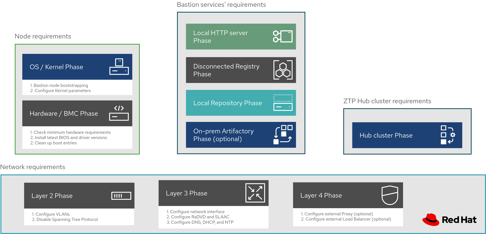

# Requirements to fully automate the initial OpenShift Hub cluster deployment

## Summary

The general workflow proposed to prepare an initial OpenShift Hub cluster with Zero Touch Provisioning (ZTP) capabilities (i.e. ACM, Assisted Installer, Metal3, Hive, etc.) is presented below.

As shown, the image breaks down the whole deployment process into node, network, and bastion services’ requirements for the initial Hub cluster automation. Each one of these requirements organizes all the needed configuration tasks into ordered phases. Specifically, each requirement has several phases, which contains a group of atomic tasks to be performed in order to fulfil its corresponding requirement entirely.

> **Note:** Procedure described in this document mainly targets telco environments, which means that the proposed methods, tools, and artifacts assume OpenShift deployments on an IPv6 network, via `virtualmedia` addressing, and with a disconnected registry. Additionally, all artifacts needed for the initial Hub cluster deployment as well as the Spoke clusters, should be served from the local network.

## Node requirements

## Network requirements

## Services' requirements
